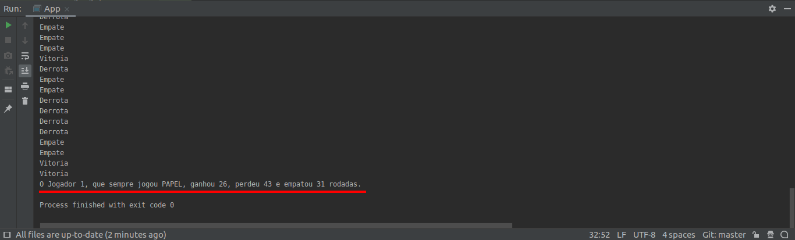

#Jankenpo
Implementação de uma aplicação de console utilizando a linguagem Java.

Foi utilizada a IDE Intellij IDEA. 
Para ver os resultados do programa basta apertar em "RUN" ou debugar o projeto.
Não é preciso nenhuma interação do usuário.
Abaixo está um exemplo de resultado no console.

